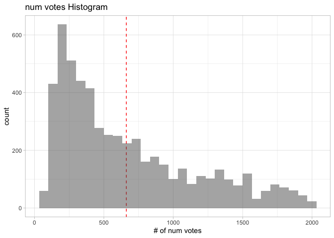

Exploratory Data Analysis
================

## EDA

``` r
# Libraries 
library(tidyverse)
library(tidymodels)
library(stringr)
library(tidytext)
library(scales)
library(widyr)
library(corrr)
library(textrecipes)
library(vip)
theme_set(theme_light())
```

``` r
train <- read_csv('input/train.csv') %>%
  select(-'...1')

test <- read_csv('input/test.csv') %>%
  select(-'...1')
```

## Explore Data Distribution

``` r
columns_row<-train %>%
  select(-game_id) %>%
  select(where(is.numeric)) %>%
  colnames()

histograms <- function(x) {
  train %>%
  ggplot(aes(x = train %>% select(x) %>% pull()))+
  geom_vline(xintercept = mean(train %>% select(x) %>% pull()), color = 'red',linetype = 'dashed')+
  geom_histogram(alpha=.5) +
  labs(x = paste0('# of ',x %>% str_replace(.,'_',' ')),
       title = paste0(x %>% str_replace(.,'_',' '),' Histogram'))
}
all_histograms <- lapply(columns_row,histograms)
all_histograms
```

    ## [[1]]

<!-- -->

    ## 
    ## [[2]]

<!-- -->

    ## 
    ## [[3]]

<!-- -->

    ## 
    ## [[4]]

<!-- -->

    ## 
    ## [[5]]

<!-- -->

    ## 
    ## [[6]]

<!-- -->

    ## 
    ## [[7]]

<!-- -->

    ## 
    ## [[8]]

<!-- -->

    ## 
    ## [[9]]

<!-- -->

    ## 
    ## [[10]]

<!-- -->

``` r
train %>%
  filter(year %in% c(2010:2017)) %>%
  group_by(year,category1) %>%
  count() %>%
  group_by(category1,year) %>%
  top_n(10,n) %>%
  filter(n>5) %>%
  ungroup() %>%
  mutate(year= factor(year),
         category1=reorder_within(category1,n,year))%>%
  ggplot(aes(n,category1,fill=year))+
  geom_col(show.legend = F)+
  scale_y_reordered() +
  facet_wrap(~year, scales = 'free')
```

<!-- -->

``` r
correlations <- train %>%
    select(where(is.numeric),-game_id) %>%
    correlate() %>%
    focus(-geek_rating, mirror = TRUE) %>%
    rearrange() %>%
    shave() %>%
    fashion()

 train %>%
    select(where(is.numeric),-game_id) %>%
    correlate() %>%
    focus(-geek_rating, mirror = TRUE) %>%
    rearrange() %>%
    shave() %>%
    rplot(colours = c('blue','red'))
```

<!-- -->

``` r
cor.test(train$age,train$avg_time)
```

    ## 
    ##  Pearson's product-moment correlation
    ## 
    ## data:  train$age and train$avg_time
    ## t = 12.028, df = 5562, p-value < 2.2e-16
    ## alternative hypothesis: true correlation is not equal to 0
    ## 95 percent confidence interval:
    ##  0.1335065 0.1847285
    ## sample estimates:
    ##       cor 
    ## 0.1592247

With the p-value I can read this problem like this :

-   The strong between age \~ avg\_time is statistically significant.
    but …
-   The correlation is weak!

``` r
train %>%
  ggplot(aes(num_votes,geek_rating,color=factor(age)))+
  geom_point() +
  labs(title = 'Relation between Rating - # of votes',
       subtitle = "Through the Participant's ages",
       y = 'Rating',
       x = 'Total Votes',
       color = 'Age')
```

<!-- -->

``` r
train %>%
  ggplot(aes(owned,geek_rating,color=factor(age)))+
  geom_point() +
  labs(title = 'Relation between Rating - Owned',
       subtitle = "Through the Participant's ages",
       y = 'Rating',
       x = 'Owned',
       color = 'Age')
```

<!-- --> \#\# PCA and
Experimental Clusters

``` r
library(ggridges)
split_metrics<-train %>%
  select(c(geek_rating,owned,age,category1))  %>%
  group_by(category1) %>%
  summarize(geek_rating_avg = mean(geek_rating),
            owned = round(mean(owned),0)) %>%
  ungroup()


categories <- train %>%
  select(c(geek_rating,owned,age,category1)) %>%
  group_by(category1) %>%
  count(sort=TRUE) %>%
  head(10) %>%
  select(category1) %>%
  pull()

train %>%
  select(c(geek_rating,owned,age,category1)) %>%
  filter(category1 %in% categories) %>%
  ggplot(aes(owned,category1,fill=category1))+
  geom_density_ridges(show.legend = FALSE) +
  labs(title = 'Density owned by top 10 Categories',
       y ='')
```

<!-- -->

``` r
# train %>%
#   select(c(geek_rating,owned,age,category1)) %>%
#   pairwise_cor(category1,geek_rating,owned,upper = FALSE, sort=TRUE) %>%
#   filter(item1 %in%)

train %>%
  filter(category1 %in% categories) %>%
  widely_svd(category1, age, owned) %>%
  filter(between(dimension, 2, 7)) %>%
  mutate(category1 = reorder_within(category1, value, dimension),
         dimension = paste0('PCA ', dimension)) %>%
  ggplot(aes(value, category1, fill = value >0)) +
  geom_col(show.legend = FALSE) +
  scale_y_reordered() +
  facet_wrap(~ dimension, scales = "free")+
  labs(title = 'PCA on Age VS Owned',
       y = '') +
  scale_x_continuous(labels = percent)
```

<!-- -->

``` r
train %>%
  filter(category1 %in% categories) %>%
  widely_svd(category1, age, geek_rating) %>%
  filter(between(dimension, 2, 7)) %>%
  mutate(category1 = reorder_within(category1, value, dimension),
         dimension = paste0('PCA ', dimension)) %>%
  ggplot(aes(value, category1, fill = value >0)) +
  geom_col(show.legend = FALSE) +
  scale_y_reordered() +
  facet_wrap(~ dimension, scales = "free")+
  labs(title = 'PCA on Age VS geek_rating',
       y = '') +
  scale_x_continuous(labels = percent)
```

<!-- -->

``` r
split_metrics %>%
  mutate(category1 =  fct_reorder(category1,geek_rating_avg)) %>%
  top_n(30,geek_rating_avg) %>%
  ggplot(aes(geek_rating_avg,category1, color = owned))+
  geom_errorbarh(aes(xmin=6,xmax=geek_rating_avg),height=0,color='gray')+
  geom_point(aes(size=geek_rating_avg))+
  scale_color_gradient(high = 'red',low = 'pink')+
  guides(size=FALSE)+
  labs(title = 'Ranking heath-lollipop Pattern by Category',
       x = 'Ranking',
       y = 'Game Category')
```

<!-- -->

``` r
train %>%
  select(c(category1,owned,geek_rating,avg_time,age)) %>%
  filter(geek_rating<8,
         avg_time<=110) %>%
  group_by(category1) %>%
  mutate(owned= owned/sum(owned)) %>%
  ungroup() %>%
  ggplot(aes(geek_rating,avg_time,z=owned))+
  stat_summary_hex(alpha = 0.8, bins = 10)+
  scale_fill_viridis_c(labels = percent) +
  labs(title = 'Distributions Geek rating with avg_time profile',
       fill= '% Owned',
       x = 'Geek Rating',
       y = 'Average Time')
```

<!-- -->
